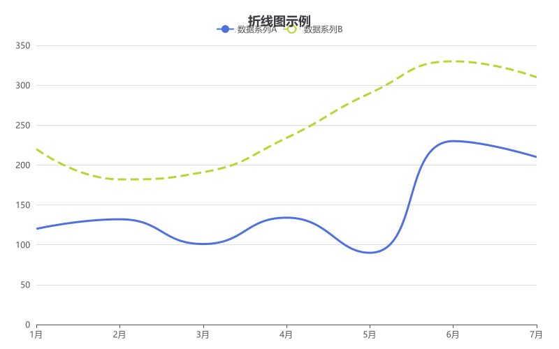
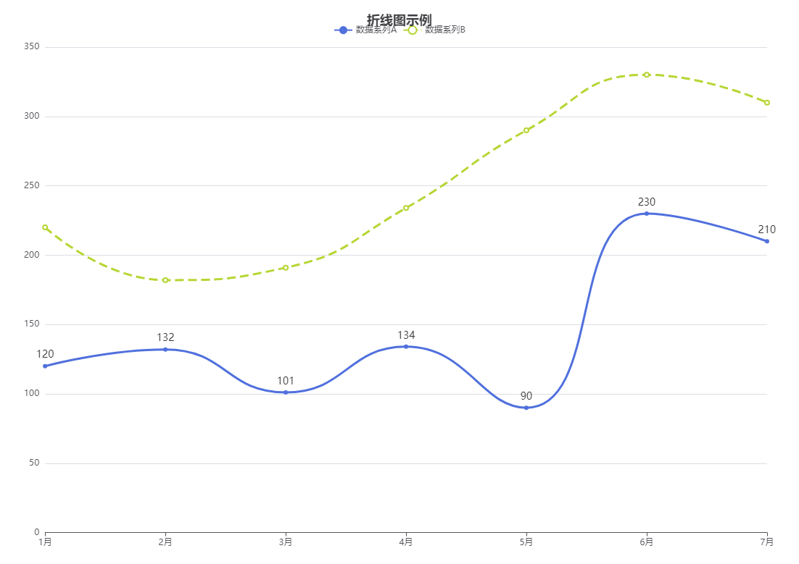

# node-echarts-demo

我有一个node应用，需要在服务端生成echarts图表。

在系列（series）中，为每个数据点设置了标签（label）并设置为显示（show: true）且位置在顶部（position: 'top'）。option的配置如下所示：

```js
const option = {
    backgroundColor: '#ffffff',
  title: {
    text: '折线图示例',
    left: 'center'
  },
  tooltip: {
    trigger: 'axis'
  },
  legend: {
    data: ['数据系列A', '数据系列B'],
    top: 30
  },
  grid: {
    left: '3%',
    right: '4%',
    bottom: '3%',
    containLabel: true
  },
  xAxis: {
    type: 'category',
    boundaryGap: false,
    data: ['1月', '2月', '3月', '4月', '5月', '6月', '7月']
  },
  yAxis: {
    type: 'value'
  },
  series: [
    {
      name: '数据系列A',
      type: 'line',
      data: [120, 132, 101, 134, 90, 230, 210],
      smooth: true,
      lineStyle: {
        width: 3
      },
      label: {
        show: true,"position": "top",
        "fontSize": 14,  // 显式指定字体大小（避免过小导致看不见）
        "color": "#333"  // 显式指定颜色（避免与背景色一致）
      },
      showAllSymbol : true,
      symbol: 'circle', // 强制显示标记点
    },
    {
      name: '数据系列B',
      type: 'line',
      data: [220, 182, 191, 234, 290, 330, 310],
      smooth: true,
      lineStyle: {
        width: 3,
        type: 'dashed'
      }
    }
  ]
}
```

但是，在实际生成图表中标签没有出现，图表如下：



依赖项版本：

```JSON
  "dependencies": {
    "canvas": "^3.2.0",
    "echarts": "^6.0.0"
  }
```

将该option放在官网示例的编辑器中，生成的图表如下：



&nbsp;

问题已解决：通过设置option.animation:false解决，issue地址：https://github.com/apache/echarts/issues/21323。


